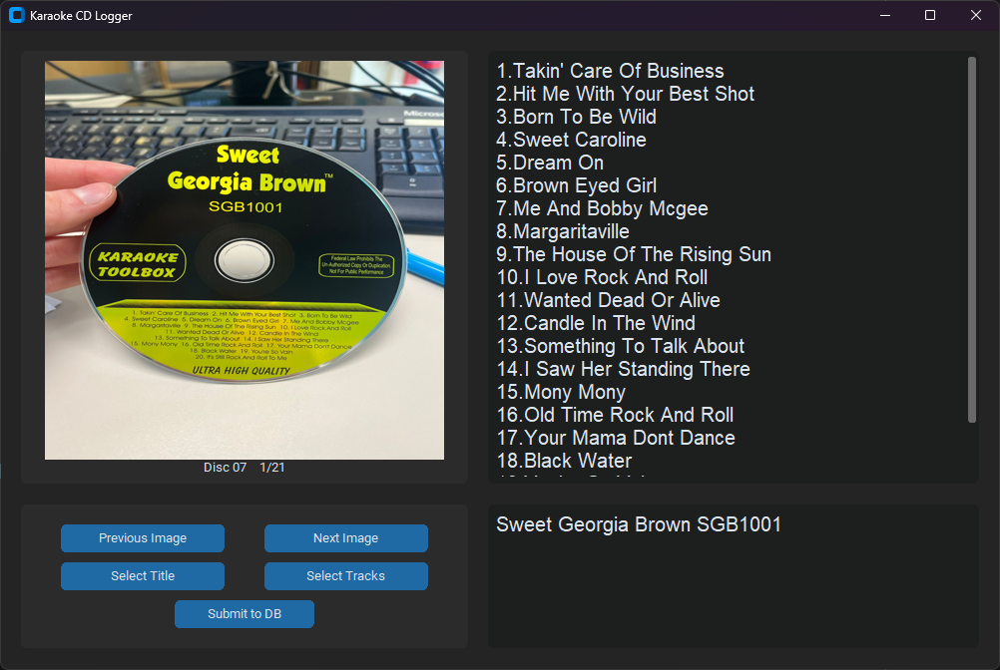

# Karaoke Cataloguer
Applications for cataloguing karaoke CDs

## main.py
Entry point for access to input and output applications

*WIP: Create GUI for entry point*

## input.py
A GUI for inputting CD titles and tracks into the karaoke database

- CD images can be browsed through using "Previous Image" and "Next Image" buttons
- Title and Tracks can be inputted using OCR assistance
  - Drag to select area to use OCR and enter to finish selection
  - If a mistake is made a new selection can be made or 'q' used to exit the cropping tool
- Corrections to OCR input can be made using text boxes on the right
  - The image can be selected if a quick preview is needed
- When all required changes/additions have been made the "Submit to DB" can be selected and the application closed

 

## output.py
A GUI for easily finding CD titles and tracks in the karaoke database

*WIP: Yet to be implemented*

## ocr.py
Helper class for OCR related functionality